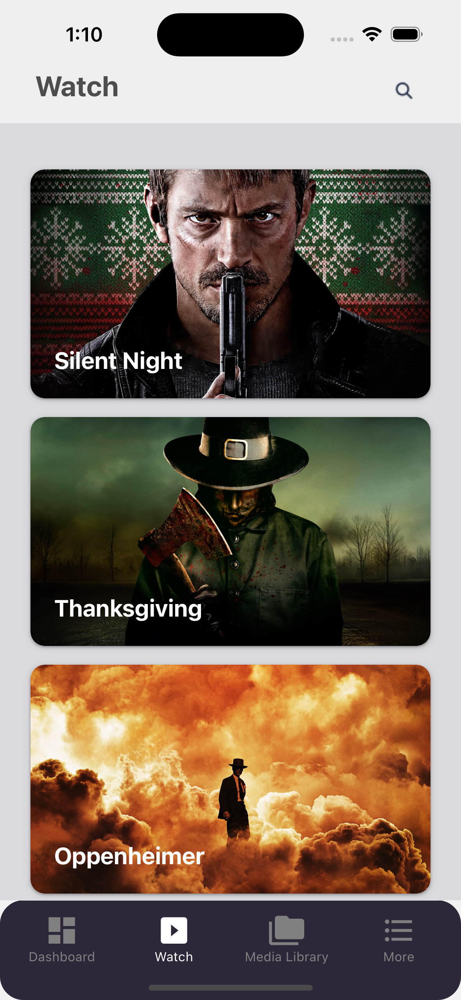
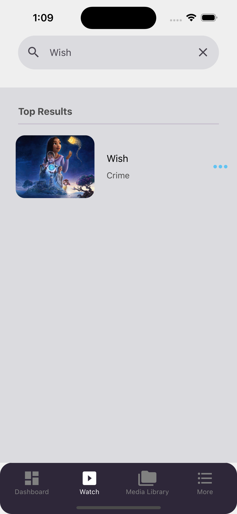
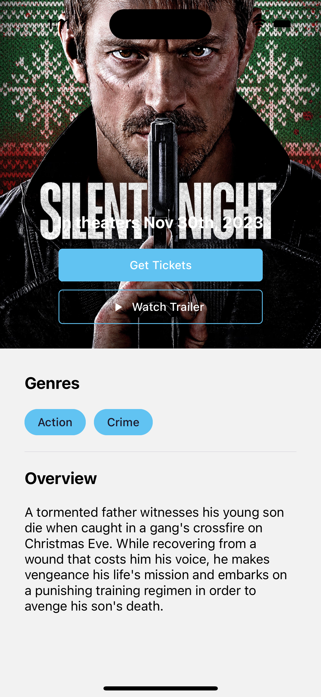
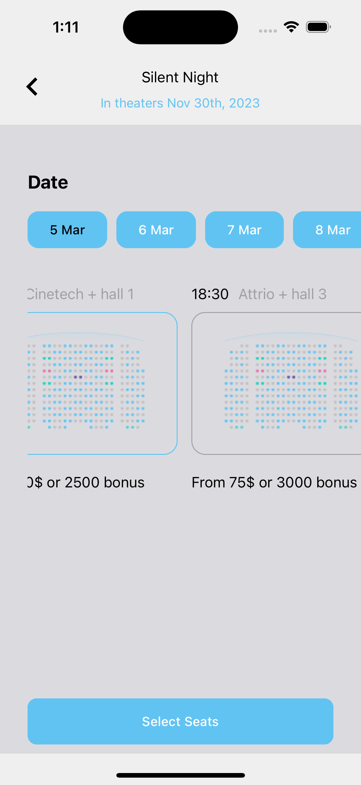
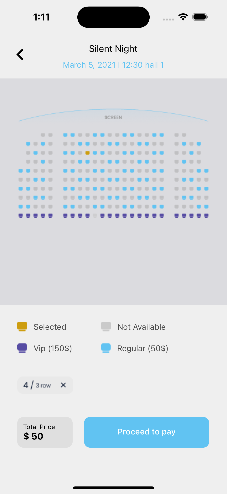
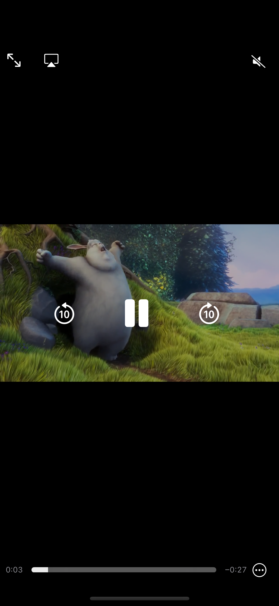

# The Movie Db App build in React-Native with love :heart:

  
  
  

🏎 A React-Native Movie App.

> This app is a fully functional Except the booking part of movies. This application was build by me and i have used multiple tools in it. For example

- React native paper for ready to use componets
- react-native-vector-icons for icons
- react-native-video for Video content
- react-navigation for navigation
- @tanstack/react-query for query needs
- react-i18next for translations
- axios and ky for http requests
- and a bit of ✨Magic ✨

## Design Overview

  
  
  
  
  
  

